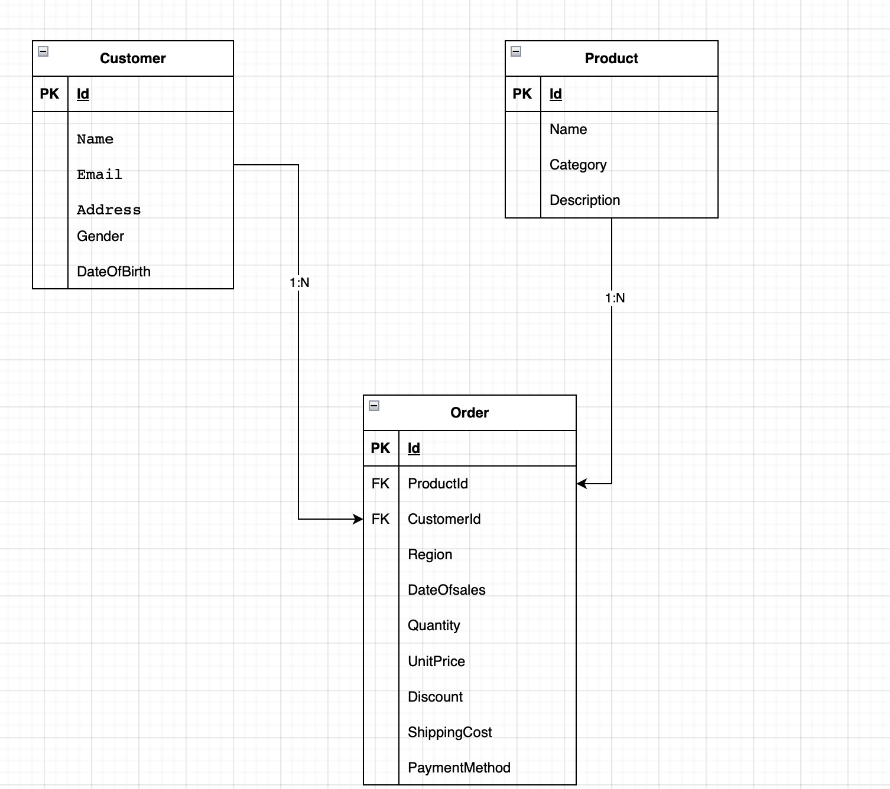

# Lumel.ApiService

## Overview

This project is built using **.NET 9.0** and is designed to read a CSV file, load its data into a SQL database, and expose APIs for processing and querying the data.

## Setup Instructions

1. **SQL Server Setup**  
   The application expects SQL Server to be running in Docker. You can either run it using the Docker command below or update the connection string in the `Lumel.ApiService` project if you're using an existing database.

2. **CSV File Location**  
   The application expects a `data.csv` file to be available at a specific path. Please provide the full path, including the file name, in the `appsettings.json` file.

3. **Running the Application**

   - Set `Lumel.ApiService` as the startup project.
   - Run the project. On startup, the application will automatically apply any pending database migrations and start the service.

4. **Background Job**  
   A background job will execute on startup, read the specified CSV file, and load its contents into the database. This job runs at a **60-minute interval** by default (configurable in `appsettings.json`).

5. **Swagger UI**  
   Once the service is running, you can access the Swagger UI at:
   - [http://localhost:5033/swagger/index.html](http://localhost:5033/swagger/index.html)
   - [http://localhost:7164/swagger/index.html](http://localhost:7164/swagger/index.html)

## API Endpoints

| Route                | Method | Request Body                             | Sample Response                    | Description                                                                  |
| -------------------- | ------ | ---------------------------------------- | ---------------------------------- | ---------------------------------------------------------------------------- |
| `/api/csv/process`   | POST   | None                                     | `"File is processed successfully"` | Processes the CSV file and loads its contents into the database.             |
| `/api/order/revenue` | GET    | Query: `startDate`, `endDate` (optional) | See sample below ↓                 | Calculates revenue between the specified `startDate` and optional `endDate`. |

<details>
  <summary>Sample Response for <code>/api/order/revenue</code></summary>

```json
{
  "totalRevenue": 1873.9884,
  "totalRevenueByProduct": [
    {
      "name": "P324",
      "revenue": 746.253
    },
    {
      "name": "P601",
      "revenue": 701.6592
    },
    {
      "name": "P664",
      "revenue": 426.0762
    }
  ],
  "totalRevenueByCategory": [
    {
      "name": "Accessories",
      "revenue": 746.253
    },
    {
      "name": "Books",
      "revenue": 426.0762
    },
    {
      "name": "Electronics",
      "revenue": 701.6592
    }
  ],
  "totalRevenueByRegion": [
    {
      "name": "Australia",
      "revenue": 426.0762
    },
    {
      "name": "Europe",
      "revenue": 701.6592
    },
    {
      "name": "North America",
      "revenue": 746.253
    }
  ]
}
```

### Database Diagram


